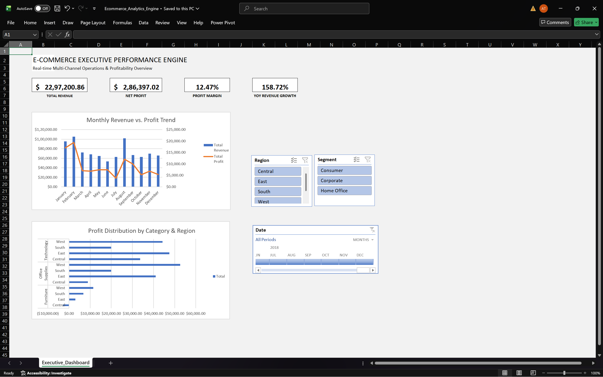
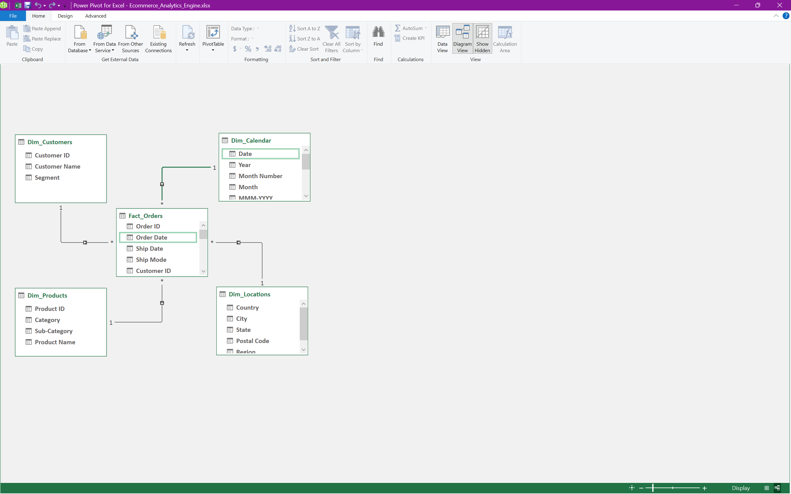

# Multi-Channel E-Commerce Analytics & Performance Engine

An end-to-end enterprise business intelligence solution and interactive executive dashboard engineered in Microsoft Excel. This project showcases automated data extraction and transformation (ETL) via **Power Query**, a normalized **Star Schema** dimensional model in **Power Pivot**, defensive **DAX** business calculations, and modern vectorized array formulas.



---

## Table of Contents
- [Executive Summary](#executive-summary)
- [Key Business Metrics & KPIs](#key-business-metrics--kpis)
- [System Architecture & Data Modeling](#system-architecture--data-modeling)
- [Power Query ETL Pipeline](#power-query-etl-pipeline)
- [DAX Formulas & Business Logic](#dax-formulas--business-logic)
- [Interactive Dashboard Features](#interactive-dashboard-features)
- [Repository Structure](#repository-structure)
- [How to Run & Refresh](#how-to-run--refresh)

---

## Executive Summary
Modern enterprise reporting frequently suffers from fragmented spreadsheets, fragile lookup formulas (`VLOOKUP`/`XLOOKUP`), and heavy workbook bloat that crashes upon scaling. 

This project solves those limitations by treating Excel as a modern analytical database engine:
1. **Zero Row-Level Formula Bloat:** Eliminates nested lookup columns across transaction records by shifting logic to an in-memory tabular engine (xVelocity/VertiPaq).
2. **Automated End-to-End Pipeline:** One-click ingestion and schema normalization from flat raw CSVs directly into the Excel Data Model.
3. **Executive-Level Visibility:** Delivers dynamic profitability tracking, time-intelligence comparisons (YoY), and regional drill-downs through synchronized slicers and custom DAX measures.

---

## Key Business Metrics & KPIs

| Metric | Business Value | DAX Implementation Highlights |
| :--- | :--- | :--- |
| **Total Revenue** | Measures top-line operational scale | Direct tabular sum over transactional order volume. |
| **Net Profit** | Measures bottom-line business health | Aggregated across discounted order lines. |
| **Profit Margin %** | Evaluates unit economics & profitability | Uses defensive zero-division handling (`DIVIDE`). |
| **YoY Revenue Growth %** | Quantifies annual scaling trajectory | Compares current period against `SAMEPERIODLASTYEAR`. |
| **Average Order Value (AOV)** | Evaluates customer spend per checkout | Evaluated dynamically over distinct order counts. |

---

## System Architecture & Data Modeling

The data model follows an enterprise **Star Schema** design built inside **Power Pivot**. The centralized transaction fact table connects to four dedicated dimension tables through one-to-many (`1:*`) relationships, preventing cyclic dependencies and ensuring fast filter context propagation.



### Schema Breakdown

* **`Fact_Orders` (Central Fact Table):**
  * Keys: `Order ID`, `Customer ID`, `Product ID`, `Postal Code`, `Order Date`, `Ship Date`
  * Measures/Attributes: `Sales`, `Quantity`, `Discount`, `Profit`, `Ship Mode`
* **`Dim_Customers`:** Unique primary key `Customer ID`, `Customer Name`, `Segment`
* **`Dim_Products`:** Unique primary key `Product ID`, `Category`, `Sub-Category`, `Product Name`
* **`Dim_Locations`:** Unique primary key `Postal Code`, `City`, `State`, `Region`, `Country`
* **`Dim_Calendar`:** Generated dynamic date table supporting continuous time-intelligence ranges (`Date`, `Year`, `Month Number`, `Month`, `MMM-YYYY`)

---

## Power Query ETL Pipeline

The ingestion pipeline was configured in **Power Query (M-Engine)** to isolate raw data from reporting layers:

1. **Staging Isolation:** Ingested raw source records into `_Staging_Superstore` with **Load to Data Model disabled** to minimize file size.
2. **Schema Normalization:** Referenced the staging query to create four dedicated dimensions and one normalized fact table.
3. **Data Quality & Cleansing:**
   * Enforced strict type typing (`Postal Code` preserved as Text to protect leading zeroes; financial fields typed as Decimal/Currency).
   * Stripped duplicates across dimension keys (`Customer ID`, `Product ID`, `Postal Code`).
   * Cleaned null attributes and standardized geographic fields.
4. **Direct Data Model Loading:** Queries were loaded exclusively as **Connection Only** and forwarded directly to the Power Pivot Data Model.

---

## DAX Formulas & Business Logic

All core reporting calculations are calculated dynamically using Data Analysis Expressions (DAX) in the Power Pivot engine:

### 1. Base Monetary Measures
```dax
Total Revenue := SUM(Fact_Orders[Sales])
```
```dax
Total Profit := SUM(Fact_Orders[Profit])
```
```dax
Total Cost := SUM(Fact_Orders[Sales]) - SUM(Fact_Orders[Profit])
```

### 2. Operational Efficiency Ratios
```dax
Total Orders := DISTINCTCOUNT(Fact_Orders[Order ID])
```
```dax
Average Order Value := DIVIDE([Total Revenue], [Total Orders], 0)
```
```dax
Profit Margin % := DIVIDE([Total Profit], [Total Revenue], 0)
```

### 3. Time Intelligence (Year-over-Year)
```dax
Prior Year Revenue := 
CALCULATE(
    [Total Revenue], 
    SAMEPERIODLASTYEAR(Dim_Calendar[Date])
)
```
```dax
YoY Revenue Growth % := 
DIVIDE(
    [Total Revenue] - [Prior Year Revenue], 
    [Prior Year Revenue], 
    0
)
```

---

## Interactive Dashboard Features

The final deliverable is an executive-facing interactive canvas (`Executive_Dashboard`):
* **Top KPI Scorecards:** Real-time summary cards displaying Total Revenue, Net Profit, Profit Margin %, and YoY Growth %.
* **Monthly Revenue vs. Profit Trend:** Combo chart (Clustered Column + Line on Secondary Axis) visualizing revenue trajectory against net profitability.
* **Category & Regional Profit Distribution:** Stacked regional bar analysis highlighting territory contributions and identifying negative margin segments (e.g., Furniture deficits in specific zones).
* **Cross-Filter Slicers & Date Timeline:** Dynamic filtering across `Region` (Central, East, South, West), `Segment` (Consumer, Corporate, Home Office), and continuous monthly timelines via unified PivotTable Report Connections.

---

## Repository Structure

```text
Ecommerce_Excel_Portfolio/
├── 01_Raw_Data/
│   └── Sample - Superstore.csv            # Source transaction data
├── 02_Final_Model/
│   └── Ecommerce_Analytics_Engine.xlsx    # Production Data Model & Dashboard
├── assets/
│   ├── dashboard_preview.png              # Executive dashboard screenshot
│   └── data_model_schema.png              # Star schema diagram view
└── README.md                              # Technical documentation
```

---

## How to Run & Refresh

1. **Clone the repository:**
   ```bash
   git clone https://github.com/<your-username>/Ecommerce_Excel_Portfolio.git
   ```
2. **Open the Model:**
   Launch `02_Final_Model/Ecommerce_Analytics_Engine.xlsx` in Microsoft Excel (Excel 2016, 2019, 2021, or Microsoft 365 with Power Pivot enabled).
3. **Interact:**
   Click any button on the **Region** or **Segment** slicers, or scrub through the **Date Timeline** to inspect cross-filtered KPIs.
4. **Refreshing Data:**
   Place updated order records into `01_Raw_Data/` and navigate to **Data > Refresh All**. The Power Query ETL pipeline and DAX measures will automatically update all visuals.
